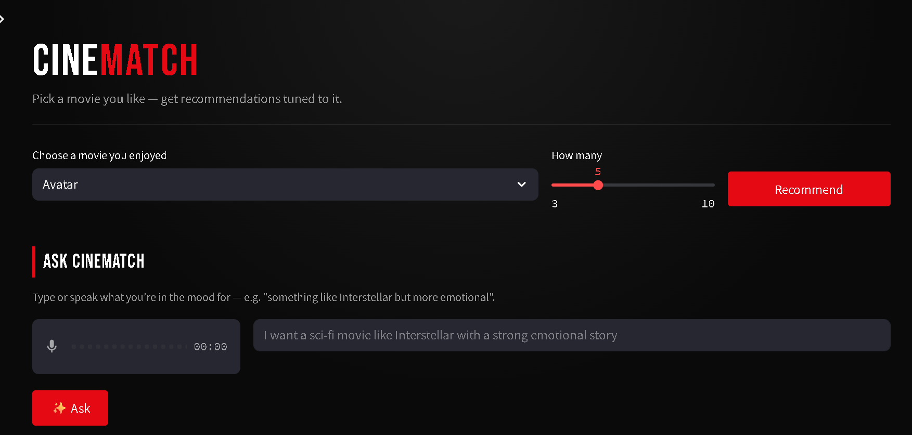
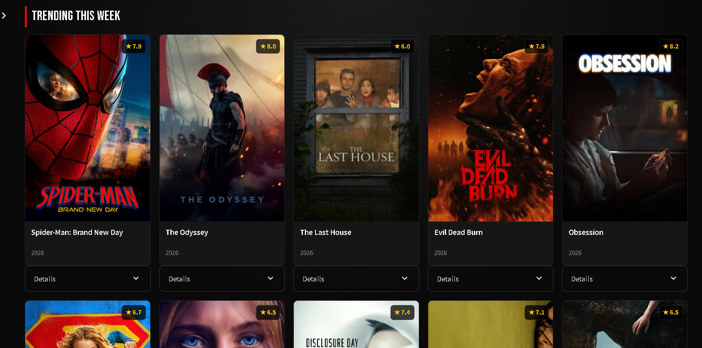
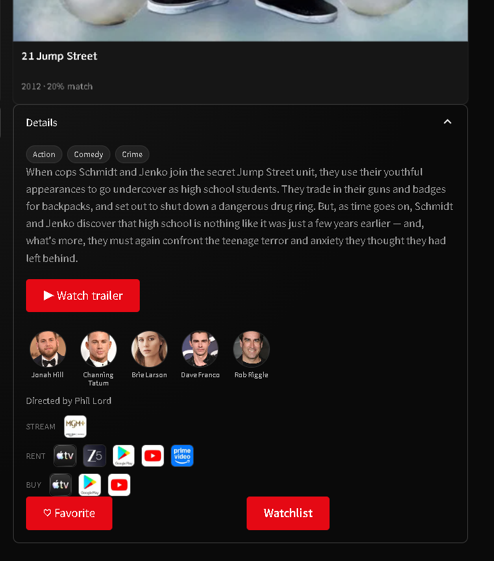
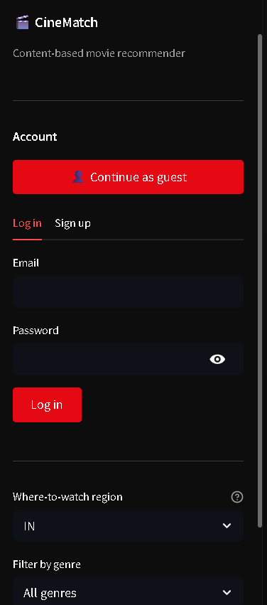

# 🎬 CineMatch — AI-Based Movie Recommender System

A content-based movie recommender built with Streamlit, enriched with live data from TMDB, persistent user accounts via Supabase, and natural-language / voice search powered by Groq. Styled with a Netflix-inspired dark UI.

> Pick a movie you like → get similarity-based recommendations, trailers, cast info, and where to stream — or just describe (or say out loud) what you're in the mood for.

---
## HomePage



## Movies Page



## Details



## ✨ Features

- **Content-based recommendations** — cosine-similarity model over a pre-computed movie dataset (`movies_dict.pkl` + `similarity.pkl`)
- **Rich movie details** — posters, ratings, release year, overview, genres, top cast + director, and official trailers, all pulled from TMDB
- **Where to watch** — streaming/rent/buy availability by region (TMDB watch-providers)
- **🤖 Natural-language search** — describe what you want ("a sci-fi movie like Interstellar with a strong emotional story") and an LLM (Groq, Llama 3.3) parses intent and returns matching picks
- **🎙️ Voice search** — speak your request; transcribed via Groq-hosted Whisper
- **Accounts, with guest login** — Supabase Auth supports full email sign-up as well as one-click anonymous/guest access with no signup friction; guest accounts can be upgraded to permanent ones without losing data
- **Favorites & watchlist** — saved per-user in Postgres (Supabase), scoped by row-level security so users only ever see their own data
- **Search history** — recent searches shown in the sidebar
- **Genre filtering** and a **trending-this-week** rail for browsing without a seed movie
- **Resilient networking** — pooled HTTP session with automatic retry/backoff, and caching throughout to minimize repeat API calls
- **Graceful degradation** — the app runs even if Supabase/Groq aren't configured; only TMDB is effectively required, and it falls back to placeholders without a key

---

## 🛠️ Tech Stack

| Layer            | Tool                                   |
|-------------------|-----------------------------------------|
| Frontend / app    | [Streamlit](https://streamlit.io)      |
| Recommendation    | scikit-learn (cosine similarity), pandas |
| Movie data        | [TMDB API](https://www.themoviedb.org/documentation/api) |
| Auth + database   | [Supabase](https://supabase.com) (Postgres, Auth, RLS) |
| AI search + voice | [Groq](https://groq.com) (Llama 3.3, Whisper) |
| Deployment        | [Render](https://render.com) |

---

## Login Page



## 📁 Project Structure

```
├── app.py                     # Main Streamlit application
├── MovieRecommendorSystem.ipynb  # Notebook: data prep + similarity model training
├── movies_dict.pkl            # Serialized movie metadata used by the app
├── similarity.pkl             # Precomputed cosine-similarity matrix (tracked via Git LFS)
├── Supabase Schema.sql        # One-time SQL setup: tables + row-level security policies
├── requirements.txt           # Python dependencies
├── LICENSE                    # Apache 2.0
└── README.md
```

---

## 🚀 Getting Started (Local)

### 1. Clone the repo

```bash
git clone https://github.com/<arpitjain985>/AI-Based-Movie-Recommended-System.git
cd AI-Based-Movie-Recommended-System
```

> `similarity.pkl` is tracked with **Git LFS** — make sure Git LFS is installed (`git lfs install`) before cloning, or run `git lfs pull` afterward, or the file will only download as a pointer.

### 2. Install dependencies

```bash
pip install -r requirements.txt
```

### 3. Configure API keys

Create `.streamlit/secrets.toml` in the project root:

```toml
TMDB_API_KEY = "your_tmdb_api_key"

SUPABASE_URL = "https://your-project-ref.supabase.co"
SUPABASE_ANON_KEY = "your_supabase_anon_public_key"

GROQ_API_KEY = "your_groq_api_key"
```

- **TMDB** — get a free key at [themoviedb.org/settings/api](https://www.themoviedb.org/settings/api). This is the only key that's effectively required; without it, posters/trailers/cast fall back to placeholders.
- **Supabase** — create a project at [supabase.com](https://supabase.com), then see [Supabase setup](#-supabase-setup) below before the app's accounts/favorites/watchlist features will work.
- **Groq** — get a free key at [console.groq.com](https://console.groq.com) → API Keys. Without it, natural-language and voice search are simply hidden.

> ⚠️ Never commit `secrets.toml` to version control. Add `.streamlit/secrets.toml` to `.gitignore`.

### 4. Run it

```bash
streamlit run app.py
```

---

## 🗄️ Supabase Setup

1. Create a new project at [supabase.com](https://supabase.com).
2. Open **SQL Editor** → paste the contents of `Supabase Schema.sql` → **Run**. This creates the `profiles`, `favorites`, `watchlist`, and `search_history` tables along with row-level security policies.
3. Go to **Authentication → Providers** and confirm **Email** is enabled.
4. Go to **Authentication → Settings** and enable **"Allow anonymous sign-ins"** — this is off by default and is required for guest login to work.
5. Go to **Settings → API Keys** and copy the **Project URL** and **`anon` / `public`** key into `secrets.toml` (see above). Never use the `service_role` key in this app — it bypasses row-level security.

---

## ☁️ Deploying on Render

Render doesn't read `.streamlit/secrets.toml` — configuration is passed via environment variables instead.

1. Push this repo to GitHub (already done ✅).
2. On Render: **New → Web Service** → connect this repository.
3. **Build Command:**
   ```
   pip install -r requirements.txt
   ```
4. **Start Command:**
   ```
   streamlit run app.py --server.port $PORT --server.address 0.0.0.0
   ```
5. Under the service's **Environment** tab, add:
   ```
   TMDB_API_KEY
   SUPABASE_URL
   SUPABASE_ANON_KEY
   GROQ_API_KEY
   ```
6. Deploy.

---

## 📓 Model Notebook

`MovieRecommendorSystem.ipynb` contains the data preparation and similarity-model training process used to produce `movies_dict.pkl` and `similarity.pkl`. Re-run it if you want to rebuild the recommendation model on a different dataset.

---

## 📄 License

Licensed under the [Apache License 2.0](LICENSE).

---

## 🙌 Acknowledgements

- Movie data and images courtesy of [The Movie Database (TMDB)](https://www.themoviedb.org/) — this product uses the TMDB API but is not endorsed or certified by TMDB.
- Built with [Streamlit](https://streamlit.io), [Supabase](https://supabase.com), and [Groq](https://groq.com).
